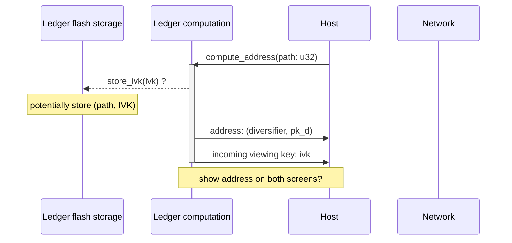
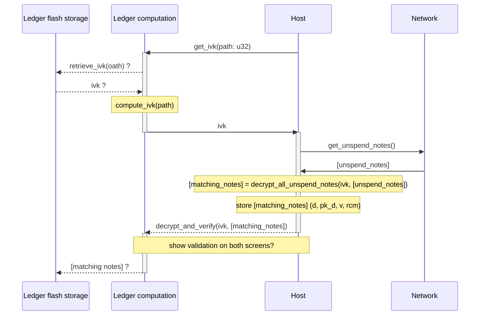
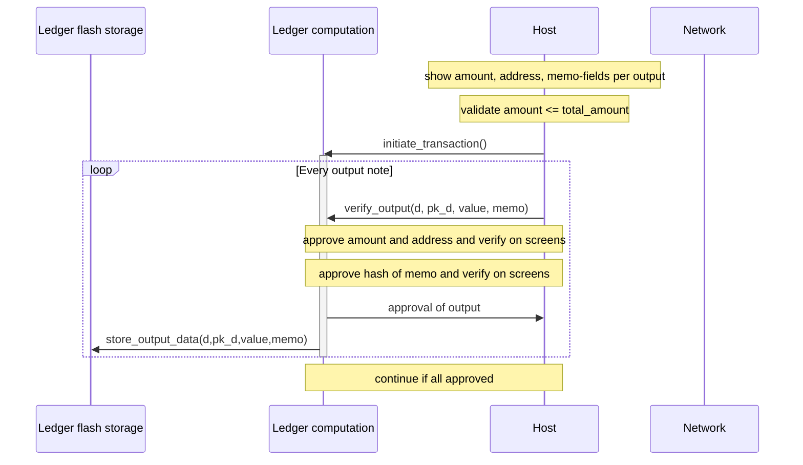
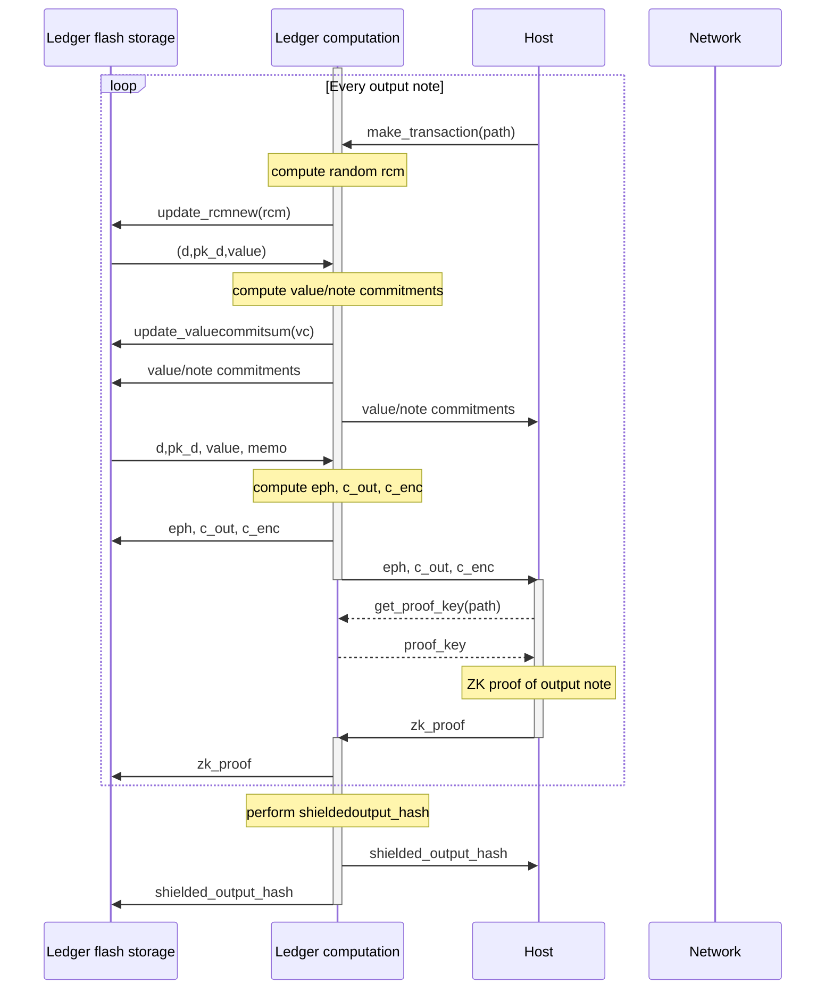
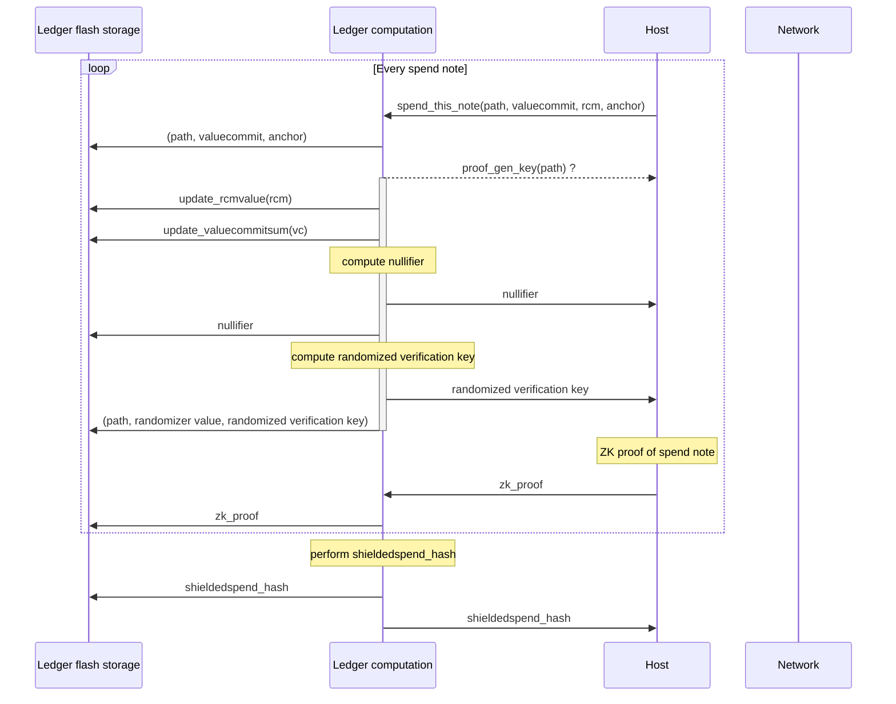
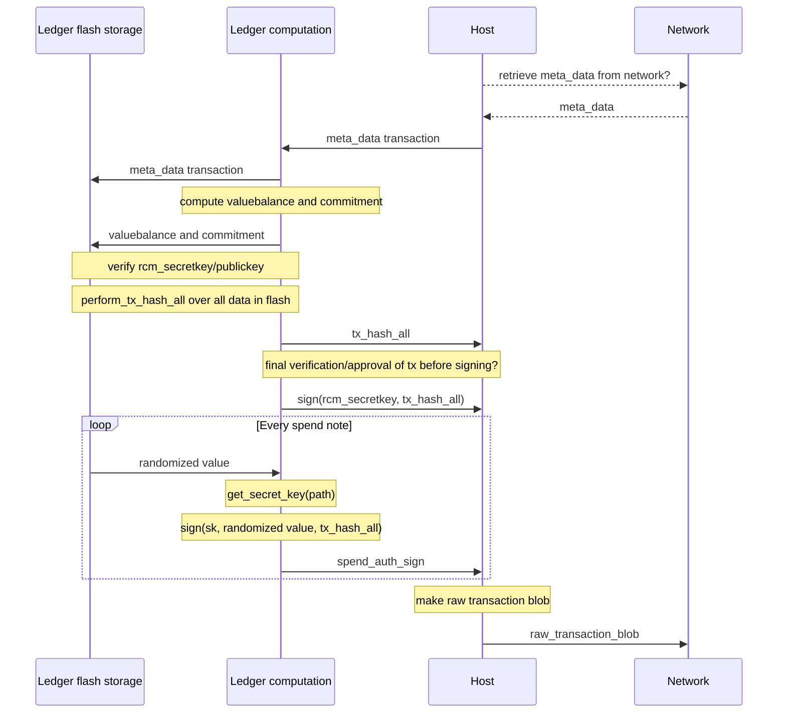

Zcash ledger, first connect:
- Address generation
- Sharing address with host
- Sharing IVK with host

Zcash ledger, syncing
- Sharing IVK with host
- Decrypt incoming notes and verification note commitments

Zcash ledger, make shielded transaction phase 1
- Verify outputs on screen

  Zcash ledger, make shielded transaction phase 2
- Process outputs and store in flash
- Compute hash of all outputs

Zcash ledger, make shielded transaction phase 3
- Process spends and store in flash
- Store RCM values in flash
- Compute hash of all outputs

Zcash ledger, make shielded transaction phase 4
- Host gives all remaining transaction (meta) data
- Ledger does the complete TX_HASH_ALL
- Final approval of transaction?
- Ledger signs the necessary parts and shares with host
- Host sends transaction blob to network

