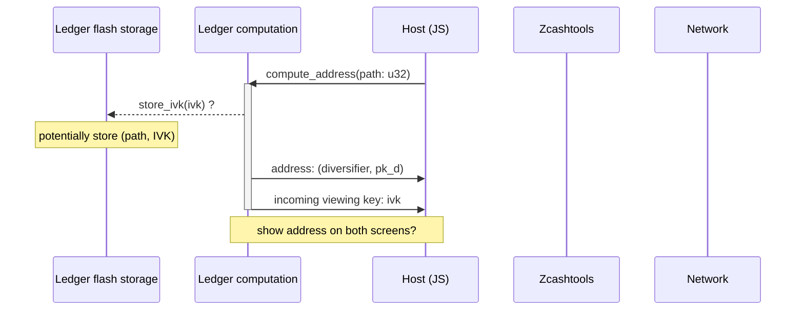
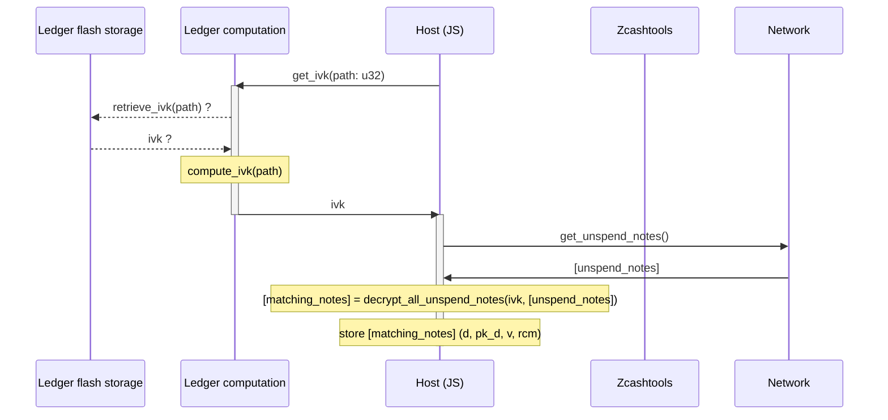
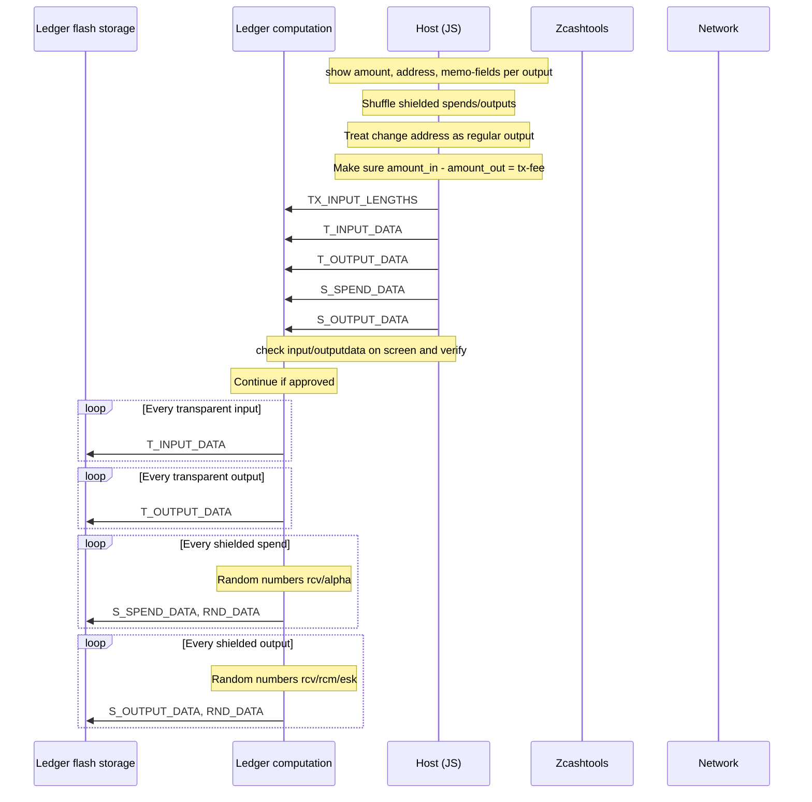
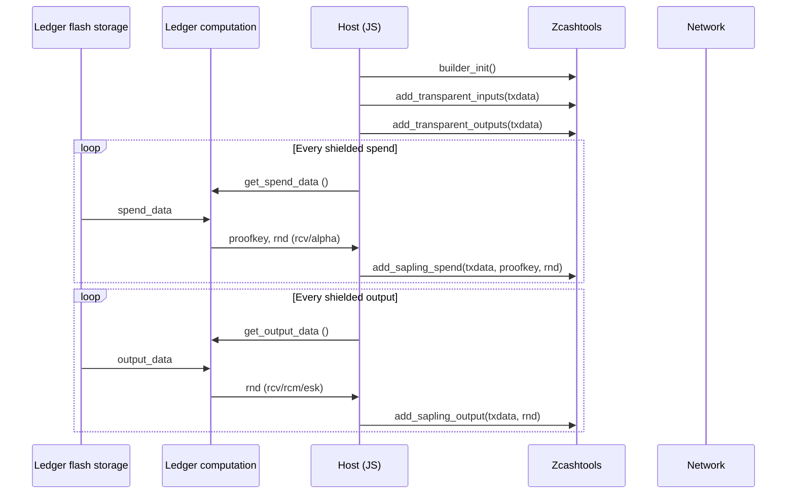
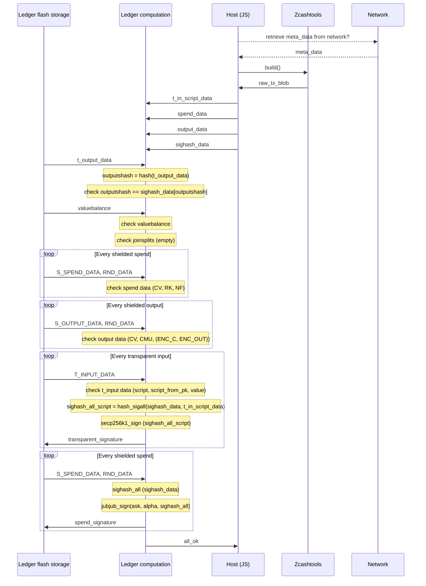
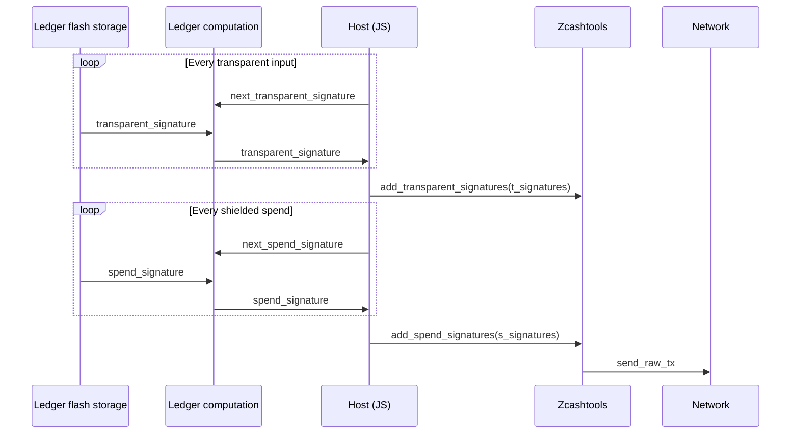

Zcash ledger, first connect:
- Address generation
- Sharing address with host
- Sharing IVK with host
//TODO: change to APDU API

Zcash ledger, syncing
- Sharing IVK with host
- Decrypt incoming notes and verification note commitments
- TODO: what to do with matching notes?

Zcash ledger, make shielded transaction phase 1
- Verify outputs on screen
- Verify enough balance
- Put relevant data in flash storage

  Zcash ledger, make shielded transaction phase 2
- Host processes everything, uses zcashtools builder
- Host asks ledger for random values to use
- Host initiates builder

Zcash ledger, make shielded transaction phase 4
- Host gives all remaining transaction data
- Ledger does the complete TX_HASH_ALL
- Ledger signs the necessary parts and shares with host
- Host sends transaction blob to network

Zcash ledger, make shielded transaction phase 5
- Finalize tx

